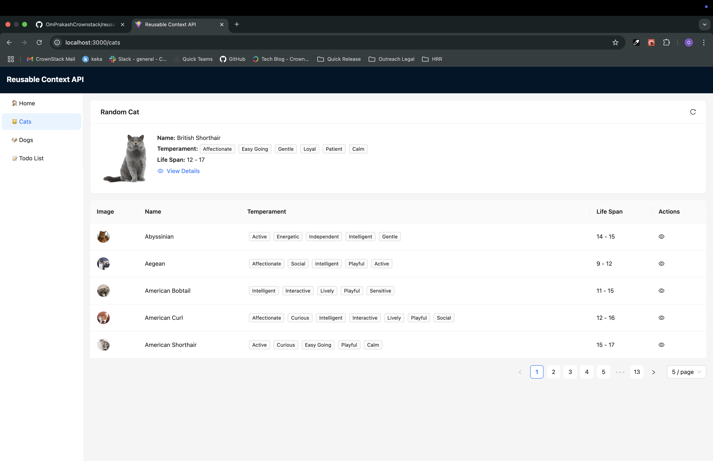
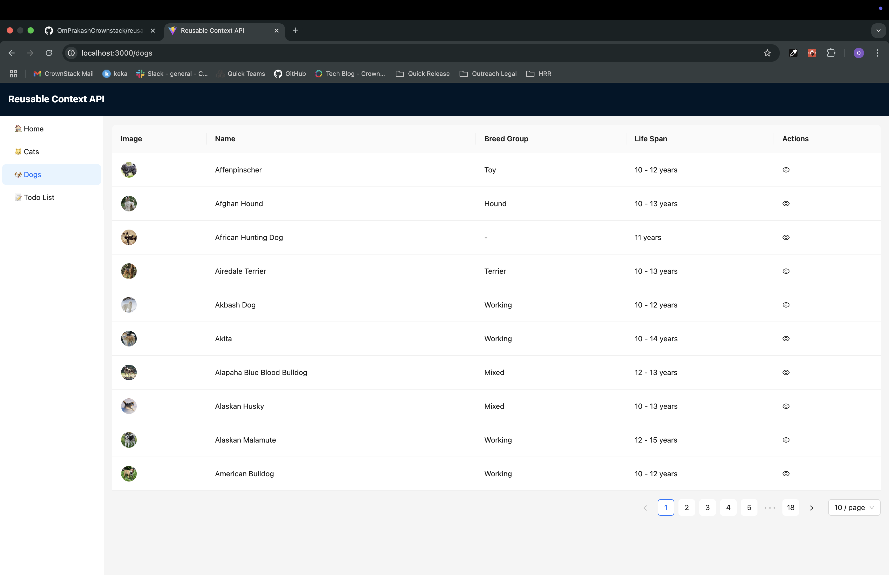
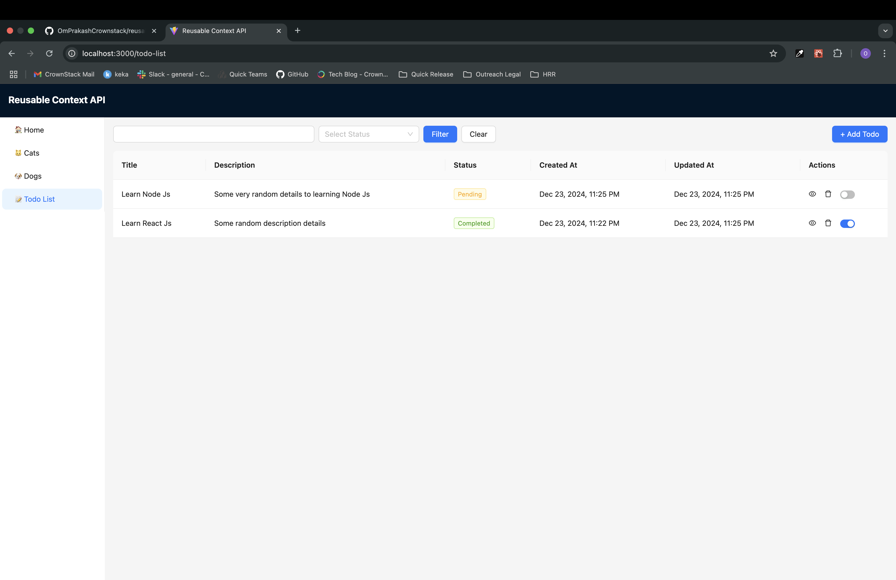

# Reusable State Management in React

This guide provides a comprehensive approach to implementing reusable state management in React applications using the Context API and a custom `BaseListContext` class. By following this pattern, developers can create scalable and reusable state management solutions for managing lists of data items to perform CRUD operations.

## The BaseListContext Class

The `BaseListContext` class is a utility for managing state, actions, and API interactions for a list of items. It abstracts common functionalities and allows you to quickly create contexts for different types of data.

## Steps to Create Your Own Context

Follow these steps to create a custom context for managing a different type of list:

### Step 1: Define the Data Type

Define the TypeScript interface for your data items. For example, to manage a list of dogs, you can create a `DogType` type:

```typescript
// DogType.ts
type DogType = {
  id: number;
  name: string;
  bred_for?: string;
  breed_group?: string;
  height: {
    imperial: string;
    metric: string;
  };
  image: {
    height: number;
    id: string;
    url: string;
    width: number;
  };
  life_span?: string;
  reference_image_id: string;
  origin?: string;
  temperament: string;
  weight: {
    imperial: string;
    metric: string;
  };
};

export default DogType
```

### Step 2: Create the Context

Use the `BaseListContext` class to create a context for your data type:

```typescript
// DogContext.ts
import BaseListContext from "./BaseListContext";
import DogType from "@/types/DogType";

const { BaseListProvider: DogContextProvider, useBaseListContext } =
  new BaseListContext<DogType>({
    name: "Dog",
    endpoint: "/public/dogs",
  }).buildContext();

const useDogContext = useBaseListContext;

export { DogContextProvider, useDogContext };
```

### Step 3: Use the Context in Components

Integrate the context into your React components to manage the state and actions of your data:

```typescript
// pages/Dogs.tsx
import { useEffect, useMemo, useState } from "react";
import { Avatar, Table, TableColumnsType, TablePaginationConfig } from "antd";
import { EyeOutlined } from "@ant-design/icons";

import DogDetailsDrawer from "@/components/DogDetailsDrawer";

import { useDogContext } from "@/context/DogContext";
import { getBoardKey } from "@/context/BaseListContext";

import { IdType, QueryParamsType } from "@/types";

const Dogs = () => {
  const [params, setParams] = useState<QueryParamsType>({ page: 1, limit: 10 });

  const {
    state: { map, boards },
    actions: { getAll },
  } = useDogContext();

  const { listMap, loading, metaData } = useMemo(() => {
    const boardKey = getBoardKey(params);
    const mBoard = boards[boardKey];

    if (!mBoard) {
      return {
        listMap: {},
        loading: true,
        metaData: {},
      };
    }

    return mBoard;
  }, [boards, params]);
  const list = listMap?.[params.page!] || [];

  const [selectedId, setSelectedId] = useState<IdType | null>(null);

  const columns: TableColumnsType<any> = useMemo(
    () => [
      {
        title: "Image",
        dataIndex: "image",
        render: (image) => <Avatar src={image?.url} />,
      },
      { title: "Name", dataIndex: "name" },
      {
        title: "Breed Group",
        dataIndex: "breed_group",
        render: (text) => text || "-",
      },
      { title: "Life Span", dataIndex: "life_span" },
      {
        title: "Actions",
        dataIndex: "actions",
        render(_, record) {
          return <EyeOutlined onClick={() => setSelectedId(record?.id)} />;
        },
      },
    ],
    [setSelectedId]
  );

  useEffect(() => {
    const params = { page: 1, limit: 10 };
    setParams(params);
    getAll(params);
  }, []);

  const onChange = ({ current, pageSize }: TablePaginationConfig) => {
    const newParams = { ...params, page: current, limit: pageSize };
    setParams(newParams);
    getAll(newParams);
  };

  return (
    <div>
      <Table
        columns={columns}
        dataSource={list.map((id: IdType) => ({ ...map[id], key: id }))}
        onChange={onChange}
        pagination={{
          total: metaData?.totalItems ?? 0,
          pageSize: params.limit,
          pageSizeOptions: [5, 10, 15],
        }}
        loading={loading}
      />

      <DogDetailsDrawer
        selectedDogId={selectedId}
        onClose={() => setSelectedId(null)}
        open={selectedId !== null}
      />
    </div>
  );
};

export default Dogs;
```

### Step 4: Implement the Context Provider

Wrap your application with the context provider to make the context available to all components:

```typescript
// App.tsx
import { ToastContainer } from "react-toastify";
import "react-toastify/dist/ReactToastify.css";

import { DogContextProvider } from "@/context/TodoListContext";
import Dogs from "@/pages/Dogs";

/**
 * Main application component.
 *
 * @returns {JSX.Element} The rendered App component.
 */
const App = () => {
  return (
    <DogContextProvider>
      <Dogs />
      <ToastContainer />
    </DogContextProvider>
  );
};

export default App;
```

## Benefits of This Approach

1. **Reusability**: By using the `BaseListContext`, you can quickly create new contexts without duplicating code.
2. **Scalability**: Easily manage complex state and actions for multiple data types.
3. **Consistency**: Ensure uniformity across your application’s state management logic.

## Example Screenshots

- **Cats Page**:
  

- **Dogs Page**:
  

- **Todo List Page**:
  

## Conclusion

By adopting this pattern, developers can streamline state management in their React applications, saving time and reducing boilerplate code.

For more information, check out the [BaseListContext class](./contextApi/BaseListContext.tsx) and the [example implementation](./example/reusable_state_using_context_api/).

## Credits

Special thanks to [Free API](https://freeapi.app/) for providing the APIs used in this project. Their resources made it possible to demonstrate this example effectively. You can find more information about their APIs on their [website](https://freeapi.app/) or [GitHub repository](https://github.com/hiteshchoudhary/apihub)


